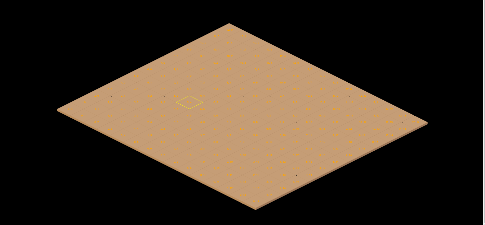

# isometric-city-game

Isometric layout grid and city building game 
This repo include serveral examples i found of games or isometric grid.
This helped me figure out how to select the squares at an angle.

Current Address [Live Isometric City Game Link](https://rococo-kleicha-53fa88.netlify.app/)

## Table of contents

- [isometric-city-game](#isometric-city-game)
  - [Table of contents](#table-of-contents)
  - [General info](#general-info)
  - [Game play](#game-play)
  - [Technologies](#technologies)
  - [Run this project locally](#run-this-project-locally)
  - [Example Project](#example-project)

## General info

<!-- <!--  -->
 -->

A database is not in use yet but will be and is currently found.
Server deployment with Vercel @ [https](https://webdesignsbytom-app.vercel.app/)

## Game play

1. Build a city on the tiles.
2. Unlock more tiles and advance through the eras of technology
3. Speed up time to complete buildings or missions

## Technologies

App developed with:

Frontend: React, JavaScript, Tailwind, Axios, validator

Backend: Express, Prisma, JavaScript

## Run this project locally

1. Fork this repository and clone the fork to your machine.
2. Navigate to client and server files and run
3. `npm ci`
4. `npm start`

## Example Project

